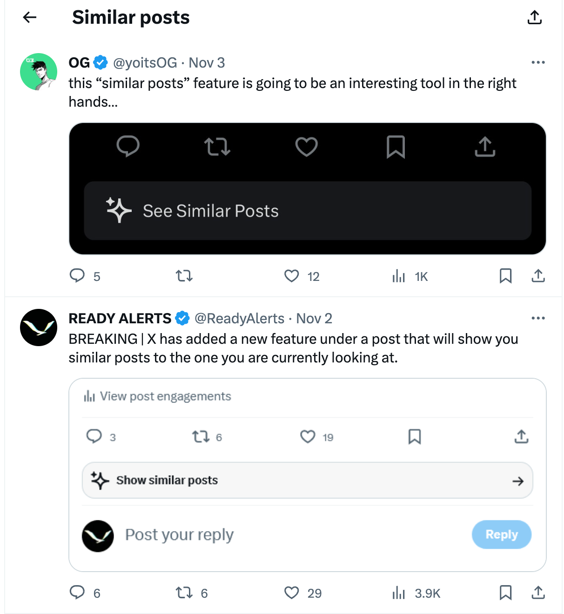

# Understanding Retrieval Augmented Generation (RAG) in the Enterprise

This article will discuss one of the most applicable uses of Language Learning Models (LLMs) in enterprise use-case, Retrieval Augmented Generation (“RAG”). RAG is the biggest business use-case of LLMs, and it will be increasingly important to understand RAG, its processes, applicability to your organization, and surrounding tooling.

RAG is a framework for improving model performance by augmenting prompts with relevant data outside the foundational model, grounding LLM responses on real, trustworthy information. Users can easily “drag and drop” their company documents into a vector database, enabling a LLM to answer questions about these documents efficiently.

In 2023, the use of LLMs saw significant growth in enterprise applications, particularly in the domain of RAG & information retrieval. According to the 2023 Retool Report, an impressive 36.2% of enterprise LLM use cases now employ RAG technology. RAG brings the power of LLMs to structured and unstructured data, making enterprise information retrieval more effective and efficient than ever.

We discuss what RAG is, the trade-offs between RAG and fine-tuning, and the difference between simple/naive and complex RAG, and help you figure out if your use-case may lean more heavily towards one or the other.

---

## How does RAG work?

A typical RAG process, as pictured below, has an LLM, a collection of enterprise documents, and supporting infrastructure to improve information retrieval and answer construction. The RAG pipeline looks at the database for concepts and data that seem similar to the question being asked, extracts the data from a vector database and reformulates the data into an answer that is tailored to the question asked. This makes RAG a powerful tool for companies looking to harness their existing data repositories for enhanced decision-making and information access.

.png>)

An example of a large production RAG implementation is probably Twitter/X’s ‘See Similar Post’ function. Here, the RAG system would chunk and store tweets in a vector database, and when you click on ‘see similar posts’, a query would retrieve similar tweets and pass them to an LLM to determine which posts are most similar to the original. This way, it gets all the powerful flexible perception abilities of an LLM to understand meaning and similar concepts rather than using traditionally inflexible techniques like keyword searching — which does not account for similarity, meaning, sentiment and misspellings, among others.

RAG is a relevant solution across a wide variety of industries and use cases. In the legal and healthcare sectors, it aids in referencing precise information from vast databases of case law, research papers, and clinical guidelines, facilitating informed decision-making. In customer service, RAG is used to power sophisticated chatbots and virtual assistants, providing accurate and contextually relevant responses to user queries. RAG is also pivotal in content creation and recommendation systems, where it helps in generating personalized content and recommendations by understanding user preferences and historical data.

---

## RAG vs Fine-Tuning

The two competing solutions for “talking to your data” with LLMs are RAG and fine-tuning a LLM model. You may typically want to employ a mixture of both, though there may be a resource trade-off consideration. The main difference is in where and how company data is stored and used. 

When you fine-tune a model, you re-train a pre-existing black-box LLM using your company data and tweak model configuration to meet the needs of your use case. RAG, on the other hand, retrieves data from externally-stored company documents and supplies it to the black-box LLM to guide response generation. 

Fine-tuning is a lengthy, costly process, and it is not a good solution for working with company documents/facts that frequently change. However, fine-tuned models are very good at recognizing and responding to subtle nuances in tone and content generation (Think of the ‘Speak like Abraham Lincoln’ or ‘Write in my writing style’-type features).

Fine-tuning is better suited for scenarios with a narrow, well-defined, static domain of knowledge and format. As Anyscale notes, “fine-tuning is for form, not facts.” For instance, in branding or creative writing applications, where the style and tone need to align with specific guidelines or a unique voice, fine-tuned models ensure the output matches the desired linguistic style or thematic consistency.

Practically, RAG is likely preferable in environments like legal, customer service, and financial services where the ability to dynamically pull vast amounts of up-to-date data enables the most accurate and comprehensive responses. Additionally, RAG excels in customer service applications, where it can swiftly provide current product information or company policies by retrieving specific data from an extensive knowledge base.

Anecdotally, enterprises are most excited to use RAG systems to demystify their messy, unstructured internal documents. The main unlock with LLM technology has been the ability to handle large corpus of messy unstructured internal documents (a likely representation of the large majority of companies with messy internal drives, etc), which has traditionally led employees to ask for information from other humans rather than trying to navigate poorly-maintained document file storage systems. This is unlike in customer service chatbots where customers have been accustomed to either call-centers or simple FAQs to find information.

.png>)

Some other practical considerations when choosing between RAG and fine-tuning:

.png>)

---

## Types of RAG

One of the first things to consider when developing a RAG product for your organization is to think about the types of questions that emerge in that specific workflow and data you are building RAG for, and what type of RAG is likely to be required.

In RAG systems, we encounter two main types: **simple (or naive)** and **complex**. In practice, this is a classification of the types of questions you will have to tackle, and depending on your use case, it is likely to have scenarios where the same workflow or the same user will have both complex and simple RAG questions.

*   **Simple RAG systems** handle straightforward queries needing direct answers, such as a customer service bot responding to a basic question like ‘What are your business hours?’. The bot can retrieve a single piece of information in a single step to answer this question.
*   **Complex RAG systems**, in contrast, are designed for intricate queries. They employ multi-hop retrieval, extracting and combining information from multiple sources. This method is essential for answering complex questions where the answer requires linking diverse pieces of information which are found in multiple documents.

A multi-hop process enables RAG systems to provide comprehensive answers by synthesizing information from interconnected data points. For example, consider a medical research assistant tool. When asked a question like “What are the latest treatments for Diabetes and their side effects?” the system must first retrieve all the latest treatments from one data source or document, then make subsequent retrievals in another data source or document in the database to gather details about their side effects.

.png>)

In the diagram above, a multi-hop reasoning system must answer several sub-questions in order to generate an answer to a complex question. To answer this question, the system must know:
1.  Who is the wife of Bill Gates?
2.  Which organizations did the wife of Bill Gates found?

Consider another practical example in the legal domain. Imagine asking a legal research tool, “How do recent changes in employment law affect remote work policies?” Here, the RAG system first retrieves the most recent updates in employment law, then performs a subsequent ‘hop’ to extract the latest remote work guidelines to understand how these changes impact these policies. This multi-step retrieval process enables the system to synthesize and contextualize legal information across separate but related legal documents and precedents, providing a detailed and legally relevant answer that addresses the nuances of both employment law and remote working policies.

Reasoning and multi-hop retrieval are long-standing considerations in the space of question and answer. As complex RAG grows in popularity, there will be increasing demand for solutions in this space.

---

## So what questions should you ask yourself?

As you think about building your first RAG system, consider about the following:

1.  Firstly, be specific about the workflow you intend to automate with RAG. Is this your customer service workflow? Or are there a specific set of 3 or 4 questions that your executive team frequently likes to ask?
2.  Secondly, work with your target user group to understand the types of questions they will ask.
3.  Thirdly, figure out where this information is stored. Are the questions already concisely answered in a single place, or does the information need to be pieced together from multiple sources?

**There are a few important things to note here:**

*   **Scattered Information:** There are some industries and workflows where the information for answers are structurally written and stored separately. The most obvious example of this is in legal workflows, where due to the nature of contracts, you may always have agreements and details that are split into multiple sub-documents, all referencing each other. In this sense, many legal questions require multi-hop reasoning due to the way legal documents are prepared.
*   **Deceptively Simple Questions:** What may initially appear to be simple questions may in fact require multi-hop reasoning. Going back to the example of business hours for a store, an employee may reasonably ask: “On public holidays, what are the business hours for the Chicago store?”. It may be the case that the information about how public holidays affect business hours (“Stores may close 1 hour earlier”) may not be in the same document as the Chicago store hours (“Chicago stores are open from 9am to 5pm”). One can argue that this might be bad data preparation within enterprises, but it is difficult to see how, for the many edge questions, this information could be prepared in an organized way. In fact, one of the key advantages of RAG is precisely to alleviate the need for structuring data meticulously, especially at scale.
*   **Poorly Formed Queries:** Something that gets missed in academic settings is the range of poorly formed questions that are asked in practical scenarios, even by sophisticated company leaders. As can be seen in the Melinda Gates example, the question could have been a ‘simple’ RAG question if the questioner had said ‘Which company did Melinda Gates found?’ Unfortunately, this is a reflection of the fact that users are used to talking to other humans, and it is easy to forget to include supporting context in your questions. Poorly phrased queries which then necessitate multi-hop reasoning are thus more common than one might expect.

A potential workaround is to require that certain questions must be phrased in a certain way. However, it is unlikely that users who are looking for a convenient solution will remember to do so, or find it convenient. There is a possibility then that adoption of RAG falters as a result of bad user queries if a multi-hop capable RAG system is not otherwise in place.

Although more complex, it may prove to be a worthwhile investment to build multi-hop capable RAG systems from Day 1 to accommodate the range of questions, data sources and use-cases that will ultimately emerge as more and more complex workflows are automated by LLMs and RAG.

*In our next article, we will review some technical considerations and limitations of RAG, and concepts and levers you should use when making production-ready RAG systems.*
