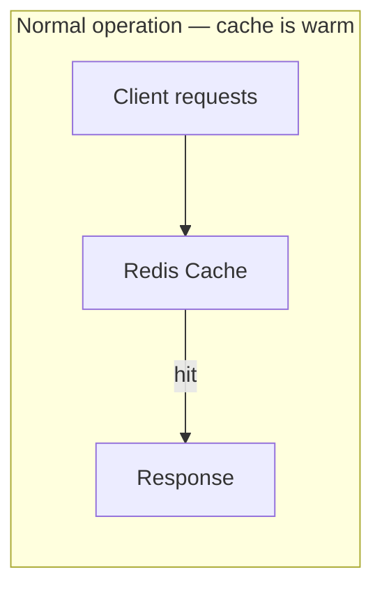
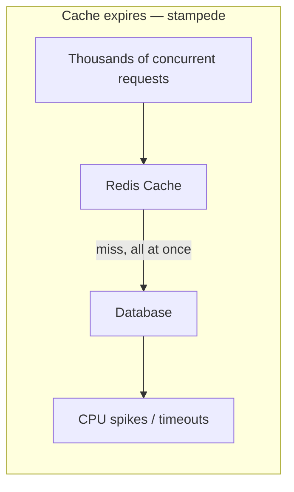
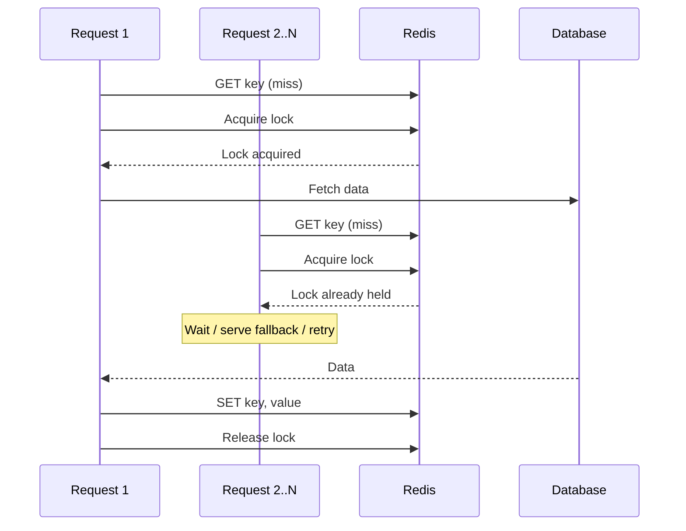
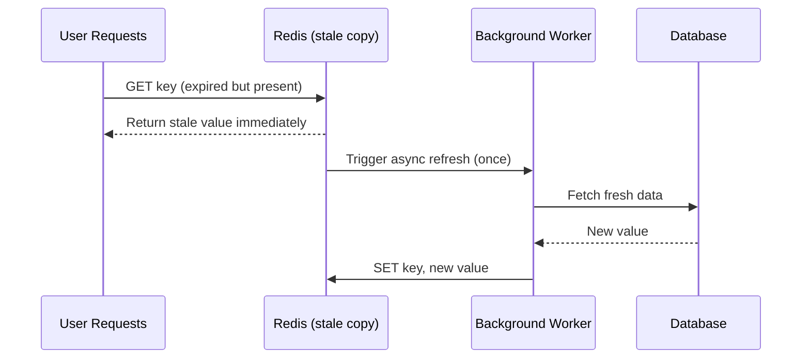
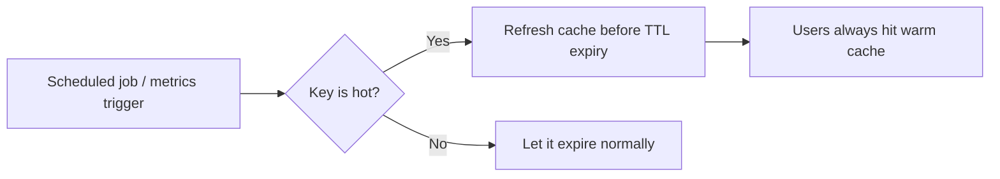
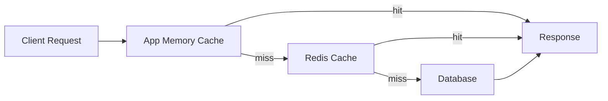
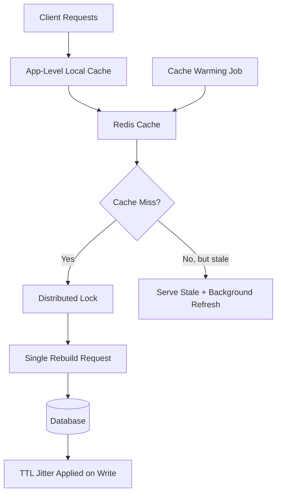

# Cache Stampede Prevention

A practical guide to understanding and preventing cache stampedes (a.k.a. the "thundering herd" problem) in high-traffic backend systems.

---

## Table of Contents

1. [What Is a Cache Stampede](#what-is-a-cache-stampede)
2. [Why It Happens](#why-it-happens)
3. [The Naive Cache Pattern](#the-naive-cache-pattern)
4. [Solution 1: Cache Locking](#solution-1-cache-locking)
5. [Solution 2: Distributed Locking](#solution-2-distributed-locking)
6. [Solution 3: Stale-While-Revalidate](#solution-3-stale-while-revalidate)
7. [The Mass-Expiration Problem](#the-mass-expiration-problem)
8. [Solution 4: TTL Jitter](#solution-4-ttl-jitter)
9. [Solution 5: Cache Warming](#solution-5-cache-warming)
10. [Solution 6: Multi-Level Caching](#solution-6-multi-level-caching)
11. [Putting It All Together](#putting-it-all-together)
12. [Summary Checklist](#summary-checklist)

---

## What Is a Cache Stampede

A cache stampede occurs when a heavily-requested cache entry expires (or is evicted), and a large number of concurrent requests all miss the cache at the same instant. Instead of each request being served quickly from cache, they all fall through to the origin — typically a database — at once.

The cache's entire purpose is to shield the database from load. When a stampede happens, the opposite occurs: the cache becomes the trigger for a sudden, concentrated burst of database traffic that the database was never sized to handle.





---

## Why It Happens

The root cause isn't the expiration itself — expiration is expected and normal. The real problem is that **many requests attempt to rebuild the exact same cache entry simultaneously**, and the origin system has no way of knowing the incoming queries are duplicates of each other.

Consider a page that takes 200ms to generate from the database. If 20,000 concurrent requests arrive in the moment the cache entry is missing, the database sees 20,000 independent, expensive queries — not one query that happens to be needed 20,000 times.

---

## The Naive Cache Pattern

A typical first-pass implementation looks like this:

```java
String value = redis.get(key);

if (value == null) {
    value = database.fetch();
    redis.set(key, value);
}
return value;
```

This works fine under normal load. The failure mode appears the moment the key expires: every concurrent request independently evaluates `value == null` as true, and every one of them calls `database.fetch()` at the same time. This is the thundering herd / cache stampede problem in its purest form.

---

## Solution 1: Cache Locking

The first line of defense is ensuring that only **one** request is allowed to rebuild an expired cache entry. All other requests should recognize that a rebuild is already underway and avoid duplicating the work.



When a request finds that the lock is already held, it typically does one of the following:

- **Wait briefly and retry** the cache lookup, expecting the value to appear shortly.
- **Serve stale data**, if a previous (expired) copy is still available.
- **Return a fallback response**, such as a default or degraded view.

Which option is appropriate depends entirely on the product's tolerance for latency versus staleness.

---

## Solution 2: Distributed Locking

Cache locking is straightforward inside a single process, but most production systems run many application instances behind a load balancer. A lock held in one server's local memory is invisible to every other server, so the locking mechanism itself must be distributed.

Redis is a common choice for this, using an atomic set-if-not-exists operation with an expiration:

```
SET homepage_lock true NX EX 10
```

Only one server across the entire fleet succeeds in setting this key; every other server sees that the lock already exists and knows a rebuild is in progress elsewhere.

**Important failure mode:** if the server holding the lock crashes before releasing it, and the lock has no expiration, no server will ever be able to rebuild the cache again. This is why distributed locks must always carry a TTL — the `EX 10` above ensures the lock self-releases even if the original holder never explicitly frees it.

---

## Solution 3: Stale-While-Revalidate

Locking protects the database, but it doesn't protect the user: while one request rebuilds the cache, everyone else queued behind the lock experiences added latency. If the rebuild takes 500ms, thousands of users feel that delay directly.

Stale-while-revalidate takes a different approach: instead of discarding expired data immediately, the system keeps serving it while a single background process refreshes the cache asynchronously.



Users receive an immediate response every time, and the refresh happens invisibly in the background. Only one worker performs the actual rebuild, so the database load stays flat regardless of how many users hit the expired key.

This means the system is knowingly serving slightly outdated data for a short window. For many types of content, that trade-off is entirely acceptable:

- Homepages
- Product catalogs
- News feeds
- Trending / recommendation widgets

The relevant question is rarely "is this data perfectly fresh?" — it's "is 30-second-old data acceptable, given that the alternative is an overloaded database?"

---

## The Mass-Expiration Problem

Locking and stale-while-revalidate solve the stampede on a *single* hot key. A related but distinct problem appears at scale: if millions of cache entries are all written with the same fixed TTL, they all expire at the same moment.

If one million product pages are cached with `TTL = 3600` seconds starting at 1:00 PM, all one million entries expire simultaneously at 2:00 PM — producing a database-wide stampede rather than a single-key stampede.

---

## Solution 4: TTL Jitter

The fix is simple: add randomness to each entry's expiration time so they don't all land on the same second.

```java
// Instead of a fixed TTL:
ttl = 3600;

// Add jitter:
ttl = 3600 + random(0, 300);
```

With jitter applied, one key might expire after 3,601 seconds, another after 3,750, another after 3,899 — expirations spread naturally across a window instead of clustering at a single instant.

```mermaid
gantt
    dateFormat  X
    axisFormat %s
    title Expiration timing: fixed TTL vs jittered TTL
    section Fixed TTL (all expire together)
    Key A :done, 0, 1
    Key B :done, 0, 1
    Key C :done, 0, 1
    section Jittered TTL (spread out)
    Key A :active, 0, 5
    Key B :active, 8, 13
    Key C :active, 20, 25
```



This is a small change with an outsized effect — it's one of those techniques that's disproportionately effective relative to how simple it is to implement.

---

## Solution 5: Cache Warming

Locking and jitter are reactive — they reduce the *damage* of a cache miss. Cache warming is proactive: for keys known to be hot, the system refreshes them **before** they expire, so users never experience a miss at all.



**Identifying hot keys** is typically done through metrics such as:

- Request frequency
- Cache hit counts
- Historical access patterns

A key receiving 50 requests a day doesn't need special handling. A key receiving 100,000 requests a minute absolutely does — and is exactly the kind of entry that justifies the operational overhead of a warming job.

---

## Solution 6: Multi-Level Caching

If Redis itself starts to feel load pressure, the next step is introducing additional cache layers closer to the application — typically an in-process/in-memory cache in front of Redis.



With this layering, a large share of requests never leave the application process at all. Redis sees a fraction of the traffic it otherwise would, and the database sees a fraction of *that*.

---

## Putting It All Together

No single technique fully solves cache stampedes — production-grade systems combine several layers, each addressing a different failure mode:



| Layer | Protects Against |
|---|---|
| Local (in-process) cache | Excessive Redis traffic |
| Redis cache | Excessive database traffic |
| Stale-while-revalidate | User-facing latency spikes during rebuild |
| Distributed locking | Duplicate concurrent rebuilds |
| TTL jitter | Synchronized mass expiration |
| Cache warming | Cache misses on known hot keys |

---

## Summary Checklist

Cache stampedes can never be fully eliminated — caches will always expire, servers will always fail, and traffic patterns will always shift. The goal isn't preventing cache misses entirely; it's ensuring that **one miss never turns into ten thousand database queries**.

- [ ] Identify hot keys using request frequency and hit-count metrics
- [ ] Prevent multiple concurrent requests from rebuilding the same key
- [ ] Use a distributed lock (with TTL) when running more than one server
- [ ] Prefer stale-while-revalidate for user-facing, latency-sensitive systems
- [ ] Add TTL jitter to avoid synchronized mass expiration
- [ ] Proactively warm known hot keys before they expire
- [ ] Layer multiple caches (local + Redis) where traffic justifies it
- [ ] Design every system assuming cache expiration *will* happen

> The cache isn't the system — it's a protective layer around the system. The moment that layer fails, the database becomes the bottleneck. Good design ensures that failure is contained, not catastrophic.
