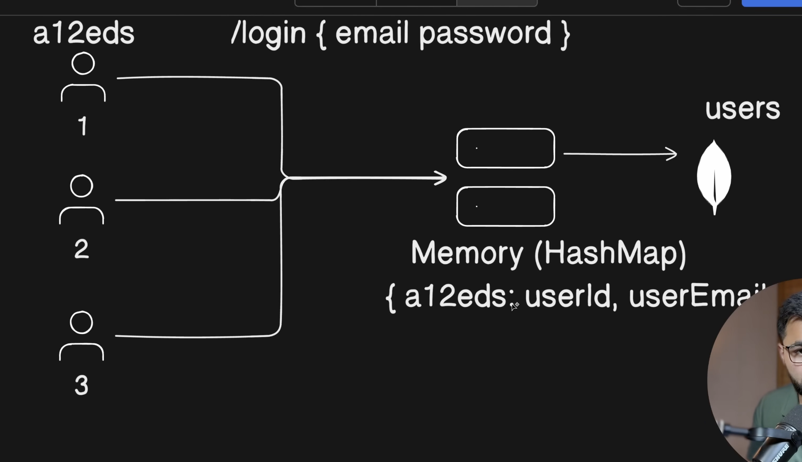
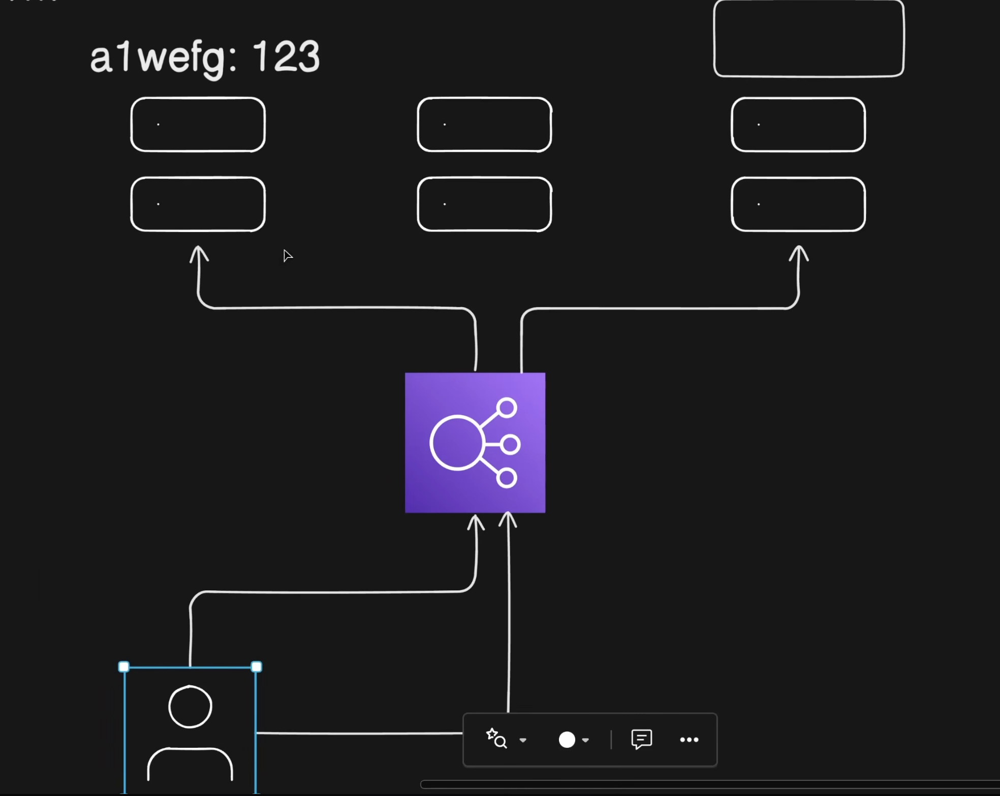
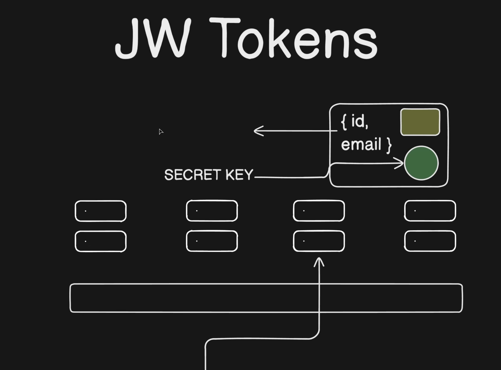
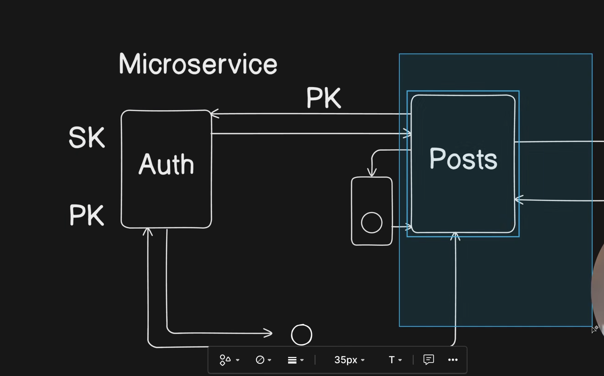

Stateful Authentication stores the authenticated user's session on the server. After a successful login, the server creates a unique session ID (for example, `a12eds`) and stores it in memory (commonly a `HashMap` or session store) along with the user's information.

```java
Session ID -> {
    userId,
    userEmail
}
```

The session ID is sent back to the client (usually as a cookie). Every time the client makes another request, it sends the session ID back to the server. The server looks up the session ID in memory, retrieves the user details, and if the session exists, the request is authenticated.

<!-- Image 1 -->


Although this works well for small applications, it becomes difficult to scale. Every active user's session must be stored in server memory. If there are millions of active users, the server must maintain millions of sessions, increasing memory usage. If the server crashes or restarts, all in-memory sessions are lost, forcing users to log in again.

Another problem appears in distributed systems. Modern applications usually run behind a Load Balancer with multiple servers.

<!-- Image 2 -->


Suppose User A logs in and Server 1 stores the session in its memory. On the next request, the Load Balancer may route the request to Server 2. Since Server 2 does not have that session stored, it considers the user unauthenticated. Synchronizing sessions between all servers is possible, but it increases complexity and infrastructure costs.

To solve these problems, stateless authentication is commonly used through **JWT (JSON Web Token)**. Instead of storing sessions on the server, the server creates a token containing user information (called the **payload**) and signs it using a **Secret Key**. The token is returned to the client and is **not stored on the server**.

<!-- Image 3 -->


A typical JWT payload contains information such as:

```json
{
  "userId": 101,
  "userEmail": "user@example.com"
}
```

Whenever the client sends another request, it includes the JWT (usually in the `Authorization` header). The request may reach **any server** behind the Load Balancer. Since every server has the same Secret Key, it can verify the token's signature without looking up any session in memory. If the signature is valid, the request is authenticated.


This makes JWT ideal for microservices because authentication no longer depends on server memory. Any service with the shared Secret Key can validate the token independently.

JWTs are **signed**, not encrypted. The payload is simply **Base64URL encoded**, meaning anyone who has the token can decode and read its contents. However, they cannot modify the payload because doing so would invalidate the signature.

---

**PASETO (Platform Agnostic Secure Tokens)** is a modern alternative to JWT that focuses on stronger security and simpler cryptography. Instead of allowing developers to choose different algorithms (which can lead to insecure configurations), PASETO provides secure defaults.

The general structure of a PASETO token is:

```text
version.purpose.payload.footer
```

PASETO supports two main token types:

### Local Tokens

Local tokens use **symmetric encryption** with a **Shared Secret Key**. The payload is encrypted, meaning even if someone steals the token, they cannot read its contents without the secret key.

```text
v2.local.<encrypted-payload>.footer
```

<!-- Image 5 -->


Since the payload is encrypted, Local tokens are a good choice when sensitive information is stored inside the token.

### Public Tokens

Public tokens use **asymmetric cryptography**. The server signs the token using a **Private Key**, and any service with the **Public Key** can verify the signature.

```text
v2.public.<signed-payload>.footer
```

<!-- Image 6 -->


The payload is **not encrypted**, so anyone can read it, but no one can modify it without the Private Key. Public tokens are useful when multiple services or third-party applications need to verify the authenticity of the token without sharing the private signing key.

---

| JWT | PASETO |
|------|---------|
| Payload is Base64URL encoded (readable) | Local tokens encrypt the payload |
| Supports multiple algorithms | Uses secure predefined algorithms |
| Can be insecure if configured incorrectly | Secure by design |
| Very widely adopted | Modern and security-focused |
| Stateless authentication | Stateless authentication |