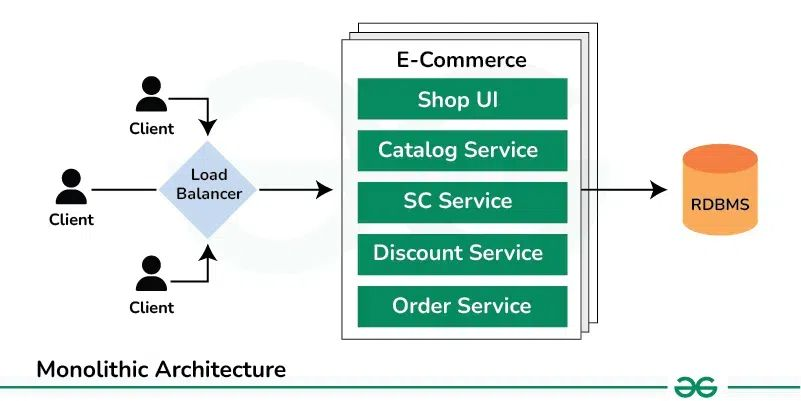

## 5. What is Monolith Architecture?
Monolithic architecture is a traditional software architecture style where all the components of a software application are tightly integrated into a single, unified executable or deployable unit. In a monolithic architecture, the entire application, including its user interface, business logic, and data access layers, is developed, deployed, and scaled as a single unit.

### Monolithic Architecture Diagram

### Key characteristics of monolithic architecture include:

* **Tight Coupling:** Components within the application are tightly coupled, meaning changes to one component may require modifications to other components.
* **Single Codebase:** The entire application is built from a single codebase, often resulting in larger and more complex codebases as the application grows.
* **Single Deployment Unit:** The application is deployed as a single unit, typically on a single server or set of servers.
* **Scalability Challenges:** Scaling a monolithic application can be challenging, as the entire application needs to be scaled together rather than scaling individual components independently.
* **Technological Homogeneity:** Components within the application typically use the same technology stack and programming language.

While monolithic architecture has been widely used and is relatively straightforward to develop and deploy, it can present challenges in terms of flexibility, scalability, and maintainability, particularly as applications grow larger and more complex.