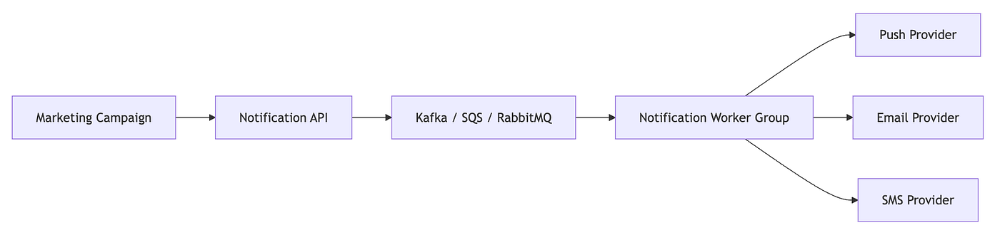

# The Question

**Aadvik:** Imagine it’s Black Friday.

Marketing wants to send one million push notifications immediately.

How would you design the system?

**Sara:** The first thing I would avoid is synchronous processing.

A common mistake is:

```java
for(User user : users) {
    notificationService.send(user);
}
```

inside a request handler.

That approach ties notification delivery directly to the application server.

If we attempt to send one million notifications synchronously:

- Request threads get blocked.
- Memory usage spikes.
- CPU utilization explodes.
- Timeouts increase.
- The application becomes unavailable.

**Aadvik:** So what’s your approach?

**Sara:** I’d decouple notification generation from notification delivery.

The application should simply create notification jobs and place them into a queue.

Worker services can process them asynchronously.

**Aadvik:** Show me the architecture.

**Sara:**



The API remains lightweight.

Its responsibility ends once the notification request is safely persisted into the queue.

**Aadvik:** Why is that better?

**Sara:** Because queues absorb traffic spikes.

Imagine one million notifications arrive in five seconds.

Without a queue:


The application must immediately process all one million requests.

That creates a massive spike.

With a queue:


The queue acts like a buffer.

Workers process notifications at a controlled rate.

**Aadvik:** What if marketing wants them delivered instantly?

Wouldn’t the queue slow things down?

**Sara:** Not necessarily.

The queue doesn’t make delivery slower.

It makes delivery controlled.

For example:

```text
1,000 Workers

100 Notifications / Second
=
100,000 Notifications / Second
```

One million notifications could still be delivered within seconds.

The difference is that the load is distributed across worker fleets instead of overwhelming the application layer.

# The First Trap

**Aadvik:** Let’s say we have 100 workers.

Each worker processes 100 notifications per second.

Everything looks good.

Then suddenly Firebase starts rate limiting us.

What happens?

**Sara:** Now we’re dealing with downstream bottlenecks.

The system isn’t constrained by our servers anymore.

It’s constrained by the notification provider.

**Aadvik:** How would you handle that?

**Sara:** I’d introduce rate limiting at the worker layer.


Even if the queue contains one million messages, workers should only send notifications at a rate the provider can handle.

**Aadvik:** Doesn’t that create a backlog?

**Sara:** Yes.

And that’s perfectly fine.

Queues exist specifically to absorb backlogs.

A growing queue is often safer than overwhelming a dependency.

# Scaling the Workers

**Aadvik:** Suppose the queue depth grows dramatically.

How would you scale?

**Sara:** Worker fleets should scale independently from the application servers.

For example:


If the queue contains:

```text
10,000 Messages
```

perhaps we run:

```text
10 Workers
```

If the queue contains:

```text
1,000,000 Messages
```

perhaps we run:

```text
1,000 Workers
```

The application layer remains untouched.

# The Second Trap

**Aadvik:** A worker crashes after successfully sending a notification but before acknowledging the message.

The queue redelivers the message.

Now what?

**Sara:** That’s a classic distributed systems problem.

The notification may already have been delivered.

The message gets delivered again.

Now we risk duplicate notifications.

**Aadvik:** How would you prevent that?

**Sara:** By making notification processing idempotent.

Every notification should have a unique notification ID.

Example:

```text
NOTIF-1001
```

Before sending:

```sql
INSERT INTO processed_notifications
(notification_id)VALUES ('NOTIF-1001');
```

with a unique constraint.

If the insert succeeds:

send notification.

If it fails:

notification was already processed.

Skip it.

**Aadvik:** Sounds familiar.

**Sara:** It’s the same principle we use in payment systems.

Retries are inevitable.

The goal is making retries harmless.

# Batching

**Aadvik:** Let’s say sending one notification requires one API call.

One million notifications means one million API requests.

Can we do better?

**Sara:** Absolutely.

Many providers support batch APIs.

Instead of:

```text
1 Request
=
1 Notification
```

we can do:

```text
1 Request
=
500 Notifications
```

Now:

```text
1,000,000 Notifications
```

becomes:

```text
2,000 Requests
```

instead of:

```text
1,000,000 Requests
```

This dramatically reduces network overhead.

# The Dead Letter Queue

**Aadvik:** What if a notification continuously fails?

For example:

- Invalid device token
- Invalid email address
- Provider rejects request

Should we retry forever?

**Sara:** No.

Retries need limits.

A common pattern is:


For example:

```text
Retry 1
Retry 2
Retry 3
Retry 4
Retry 5
```

After the maximum retry count:

```text
Move To DLQ
```

Operations teams can later inspect and resolve failures.

# The Third Trap

**Aadvik:** What if the campaign targets 100 million users instead of one million?

Would you still place 100 million messages directly into Kafka?

**Sara:** Probably not.

At that scale I’d separate campaign definition from notification generation.

Instead of generating all messages immediately:


The generator can progressively create notification jobs.

This avoids flooding Kafka with hundreds of millions of records at once.

# Delivery Tracking

**Aadvik:** Marketing wants analytics.

They want to know:

- Sent
- Delivered
- Opened
- Failed

How would you support that?

**Sara:** Notification providers usually emit callbacks.

I’d process them asynchronously as events.


This keeps analytics separate from notification delivery.

# Concluding the interview

**Aadvik:** Summarize your design.

**Sara:** My architecture would include:

1. Queue-based asynchronous processing.
2. Independent worker fleets.
3. Autoscaling based on queue depth.
4. Provider rate limiting.
5. Idempotent notification processing.
6. Batch delivery whenever possible.
7. Retry queues with exponential backoff.
8. Dead Letter Queues for failed messages.
9. Delivery tracking through asynchronous events.

Most engineers focus on sending notifications quickly.

Large-scale systems focus on sending notifications safely.

The real challenge isn’t pushing one million messages.

It’s ensuring one million messages don’t bring down your entire platform.